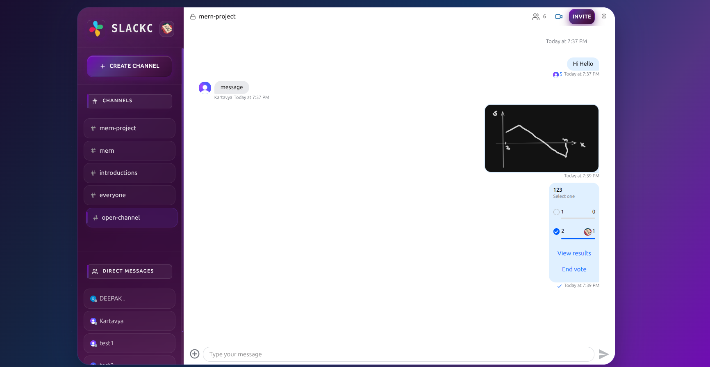

# Slackc - Team Collaboration & Communication Platform

<div align="center">

<p align="center">
  
</p>

**A full-stack web-app built with the MERN, featuring real-time messaging, video calls, and comprehensive collaboration tools.**


</div>

---

## 📸 Screenshots

### Authentication & Landing Page

*Elegant authentication interface with social login options*

### Real-time Chat Interface

*Seamless messaging experience with channels, DMs, and rich features*

### Video Call Experience

*High-quality video calls with screen sharing capabilities*

---

## 🎥 Video Walkthrough

[](https://youtu.be/a88XoCC7Rg8)

**Click above to watch a comprehensive walkthrough of the application**


---


## 📋 Table of Contents

- [Introduction](#-introduction)
- [Test the Deployed Platform](#-test-the-deployed-platform)
- [Features](#-features)
- [Tech Stack](#-tech-stack)
- [Project Checklist](#-project-checklist)
- [Environment Setup](#-environment-setup)
- [Installation Guide](#-installation-guide)
- [Project Structure](#-project-structure)
- [API Documentation](#-api-documentation)
- [Contributing](#-contributing)
- [Credits](#-credits)
- [Contact & Support](#-contact-&-support)

---

<details>
<summary><h2>🚀 Introduction</h2></summary>

**Slackc** is a modern, full-stack team collaboration platform inspired by Slack. This project was developed as a final term project to demonstrate deep understanding of the MERN (MongoDB, Express.js, React, Node.js) stack and modern web development practices.

### 🎯 Project Goals

- **Technical Mastery**: Implement complex real-time features using cutting-edge technologies
- **Scalable Architecture**: Build a production-ready application with proper error handling and monitoring
- **User Experience**: Create an intuitive, responsive interface that rivals commercial applications
- **Best Practices**: Follow industry standards for code organization, security, and deployment

### 🌟 Why This Project Stands Out

1. **Real-time Communication**: Leveraging WebSocket connections for instant messaging
2. **Video Integration**: Built-in audio/video calling with screen sharing
3. **Enterprise Features**: Advanced capabilities like threads, polls, and message reactions
4. **Production-Ready**: Includes error tracking (Sentry), background jobs (Inngest), and comprehensive authentication
5. **Modern Stack**: Uses the latest versions of MERN stack technologies with TypeScript support


</details>

---

<details>
<summary><h2>🏁 Test the Deployed Platform</h2></summary>


🌐 **Deployed Platform Link**: [https://slack-clone-frontend-fawn.vercel.app/](https://slack-clone-frontend-fawn.vercel.app/)

**Test Credentials**: You can sign in using any dummy credentials something like this
- Name: `test1`
- Email: `test1@gmail.com`

</details>

---

<details>
<summary><h2>✨ Features</h2></summary>

## ✨ Features

### 🔐 Authentication & Authorization
- **Multi-Provider Authentication** via Clerk
  - Google OAuth
  - Apple ID
  - GitHub OAuth
  - Email/Password
- JWT token verification and session management
- Secure user profile management
- Account deletion with data cleanup

### 💬 Real-time Messaging
- **Instant messaging** powered by Stream Chat
- **Typing indicators** to show when others are composing
- **Unread message counters** for channels and DMs
- **Message threading** for organized conversations
- **Emoji reactions** on messages
- **Pin important messages** for quick access
- **File sharing** with drag-and-drop support
- **Create polls** for team decision-making

### 📢 Channels & Communication
- **Channel Creation**
  - Public channels (discoverable by all team members)
  - Private channels (invite-only)
- **Direct Messaging (DMs)** for one-on-one conversations
- **Member management** with invite functionality
- **Channel discovery** and search
- **Custom channel metadata** and descriptions

### 🎥 Audio/Video Capabilities
- **High-quality video calls** using Stream Video SDK
- **Audio-only calling** option
- **Screen sharing** for presentations and collaboration
- **Call notifications** via in-app messages
- **Multi-participant support**

### 🎨 User Experience
- **Modern, responsive UI** that works on all devices
- **Real-time presence indicators** (online/offline status)
- **Rich text formatting** support
- **Dark mode inspired design** for reduced eye strain
- **Smooth animations and transitions**
- **Accessible design** following WCAG guidelines

### 🔧 Technical Features
- **Error monitoring** with Sentry integration
- **Background job processing** via Inngest
- **Webhook handling** for user lifecycle events
- **Database optimization** with MongoDB indexes
- **API rate limiting** and security measures
- **CORS configuration** for secure cross-origin requests


</details>

---

<details>
<summary><h2>🛠️ Tech Stack</h2></summary>

### Frontend
- **React 19.2** - Latest React with concurrent features
- **Vite** - Lightning-fast build tool
- **React Router v7** - Client-side routing
- **Stream Chat React** - Pre-built chat components
- **Stream Video React** - Video calling SDK
- **Clerk React** - Authentication components
- **TanStack Query** - Server state management
- **Axios** - HTTP client
- **Lucide React** - Icon library
- **React Hot Toast** - Notifications
- **Tailwind CSS** - Utility-first styling

### Backend
- **Node.js** - JavaScript runtime
- **Express.js 5** - Web application framework
- **MongoDB** - NoSQL database
- **Mongoose** - MongoDB ODM
- **Clerk Express** - Authentication middleware
- **Stream Chat** - Chat backend SDK
- **Inngest** - Background job processor
- **Sentry Node** - Error tracking
- **CORS** - Cross-origin resource sharing
- **dotenv** - Environment configuration

### Third-Party Services
- **Clerk** - Authentication & user management
- **Stream** - Chat & video infrastructure
- **MongoDB Atlas** - Cloud database
- **Sentry** - Error monitoring & performance tracking
- **Inngest** - Event-driven workflows
- **Vercel** - Frontend hosting
- **Vercel/Node** - Backend serverless functions

### Development Tools
- **Nodemon** - Auto-restart dev server
- **ESLint** - Code linting
- **Prettier** - Code formatting
- **Git** - Version control

</details>

---

<details>
<summary><h2>✅ Project Checklist</h2></summary>

### Requirements Met

#### Core Functionality ✓
- [x] User authentication with multiple providers
- [x] Real-time messaging capabilities
- [x] Database integration (MongoDB)
- [x] RESTful API design
- [x] Responsive frontend design
- [x] State management implementation
- [x] Error handling and validation

#### Advanced Features ✓
- [x] WebSocket integration for real-time updates
- [x] File upload and management
- [x] Video/audio calling functionality
- [x] Background job processing
- [x] Webhook handling
- [x] Third-party API integrations
- [x] Environment-based configuration
- [x] Security best practices (CORS, JWT, input validation)

#### Code Quality ✓
- [x] Clean, modular code architecture
- [x] Proper separation of concerns (MVC pattern)
- [x] Reusable React components
- [x] Custom hooks for logic reuse
- [x] Comprehensive error handling
- [x] Environment variable management
- [x] Code comments and documentation

#### Production Readiness ✓
- [x] Error monitoring (Sentry)
- [x] Performance optimization
- [x] Scalable database design
- [x] API rate limiting considerations
- [x] Secure authentication flow
- [x] HTTPS-ready configuration
- [x] Deployment to production platforms

#### User Experience ✓
- [x] Intuitive user interface
- [x] Loading states and feedback
- [x] Error messages and notifications
- [x] Responsive design (mobile-friendly)
- [x] Smooth animations and transitions
- [x] Accessibility considerations

#### Testing & Documentation ✓
- [x] Clear project documentation
- [x] Setup instructions
- [x] Environment configuration guide
- [x] API endpoint documentation
- [x] Code comments for complex logic

</details>

---

<details>
<summary><h2>🔧 Environment Setup</h2></summary>

### Required API Keys & Services

Before setting up the project, you'll need accounts and API keys from these services:

1. **MongoDB Atlas** (Free Tier Available)
   - Create account: [https://www.mongodb.com/cloud/atlas/register](https://www.mongodb.com/cloud/atlas/register)
   - Get connection string from your cluster

2. **Clerk** (Free Tier: 10,000 MAUs)
   - Create account: [https://clerk.com](https://clerk.com)
   - Create a new application
   - Get Publishable Key and Secret Key from Dashboard
   - Configure authentication methods (Google, GitHub, Apple)

3. **Stream** (Free Tier: 25 users)
   - Create account: [https://getstream.io](https://getstream.io)
   - Create a new app
   - Get API Key and API Secret from Dashboard
   - Enable Chat and Video features

4. **Sentry** (Free Tier: 5K errors/month)
   - Create account: [https://sentry.io](https://sentry.io)
   - Create a new project (Node.js for backend, React for frontend)
   - Get DSN from project settings

5. **Inngest** (Free Tier: 50K events/month)
   - Create account: [https://www.inngest.com](https://www.inngest.com)
   - Get Event Key and Signing Key from Dashboard

### Environment Variables Structure

#### Backend Environment (`/backend/.env`)
```env
# Server Configuration
PORT=5001
NODE_ENV=development

# Database
MONGO_URI=mongodb+srv://<username>:<password>@cluster.mongodb.net/slackc

# Authentication (Clerk)
CLERK_PUBLISHABLE_KEY=pk_test_xxxxxxxxxxxxxxxxxxxxxxxxxxxxx
CLERK_SECRET_KEY=sk_test_xxxxxxxxxxxxxxxxxxxxxxxxxxxxx

# Chat & Video (Stream)
STREAM_API_KEY=xxxxxxxxxxxxx
STREAM_API_SECRET=xxxxxxxxxxxxxxxxxxxxxxxxxxxxx

# Error Monitoring (Sentry)
SENTRY_DSN=https://xxxxxxxxxxxxx@xxxxx.ingest.sentry.io/xxxxx

# Background Jobs (Inngest)
INNGEST_EVENT_KEY=xxxxxxxxxxxxxxxxxxxxxxxxxxxxx
INNGEST_SIGNING_KEY=signkey-test-xxxxxxxxxxxxxxxxxxxxxxxxxxxxx

# CORS Configuration
CLIENT_URL=http://localhost:5173
```

#### Frontend Environment (`/frontend/.env`)
```env
# Authentication (Clerk)
VITE_CLERK_PUBLISHABLE_KEY=pk_test_xxxxxxxxxxxxxxxxxxxxxxxxxxxxx

# Chat & Video (Stream)
VITE_STREAM_API_KEY=xxxxxxxxxxxxx

# Error Monitoring (Sentry)
VITE_SENTRY_DSN=https://xxxxxxxxxxxxx@xxxxx.ingest.sentry.io/xxxxx

# API Configuration
VITE_API_BASE_URL=http://localhost:5001/api
```


</details>

---

<details>
<summary><h2>📦 Installation Guide</h2></summary>

### Step-by-Step Setup

#### 1. Clone the Repository
```bash
git clone https://github.com/yourusername/slackc.git
cd slackc
```

#### 2. Backend Setup
```bash
# Navigate to backend directory
cd backend

# Install dependencies
npm install

# Create .env file
cp .env.example .env
# Edit .env with your credentials (see Environment Setup section above)

# Start development server
npm run dev
```

The backend server will start at `http://localhost:5001`

#### 3. Frontend Setup

Open a new terminal window:
```bash
# Navigate to frontend directory from project root
cd frontend

# Install dependencies
npm install

# Create .env file
cp .env.example .env
# Edit .env with your credentials (see Environment Setup section above)

# Start development server
npm run dev
```

The frontend application will start at `http://localhost:5173`

#### 4. Configure Clerk Authentication

1. Go to [Clerk Dashboard](https://dashboard.clerk.com)
2. Navigate to your application
3. Go to **User & Authentication** → **Social Connections**
4. Enable and configure:
   - Google OAuth
   - GitHub OAuth
   - Apple ID
5. Update redirect URLs to include `http://localhost:5173`

#### 5. Configure Stream Services

1. Go to [Stream Dashboard](https://dashboard.getstream.io)
2. Navigate to your app
3. Enable **Chat** and **Video** features
4. Configure webhook URL (for production): `https://your-backend-url/api/stream-webhooks`

#### 6. Configure Inngest Webhooks

1. Go to [Inngest Dashboard](https://app.inngest.com)
2. Set up webhook endpoint: `http://localhost:5001/api/inngest`
3. For development, use Inngest Dev Server:
```bash
   npx inngest-cli@latest dev
```

### Verify Installation

1. **Backend Health Check**
```bash
   curl http://localhost:5001/
   # Should return: "Hello World!"
```

2. **Frontend Access**
   - Open browser to `http://localhost:5173`
   - You should see the Slackc authentication page

3. **Test Authentication**
   - Click "Get Started with Slackc"
   - Sign in with any configured provider
   - You should be redirected to the chat interface

### Common Setup Issues

<details>
<summary><b>MongoDB Connection Error</b></summary>

**Error**: `Error Connecting with DB`

**Solution**:
- Verify your MongoDB URI in `.env`
- Check if your IP is whitelisted in MongoDB Atlas
- Ensure your cluster is active
</details>

<details>
<summary><b>Clerk Authentication Fails</b></summary>

**Error**: `Clerk authentication not working`

**Solution**:
- Verify both Publishable and Secret keys are correct
- Check that redirect URLs are configured in Clerk Dashboard
- Clear browser cookies and try again
</details>

<details>
<summary><b>Stream Connection Error</b></summary>

**Error**: `Cannot connect to Stream`

**Solution**:
- Verify API Key and Secret are correct in both frontend and backend `.env`
- Check that Chat and Video are enabled in Stream Dashboard
- Ensure you haven't exceeded free tier limits
</details>

<details>
<summary><b>Port Already in Use</b></summary>

**Error**: `Port 5001 (or 5173) is already in use`

**Solution**:
- Change port in backend: `PORT=5002` in backend `.env`
- Change port in frontend: Run `npm run dev -- --port 5174`
- Update `CLIENT_URL` and `VITE_API_BASE_URL` accordingly
</details>

</details>

---

<details>
<summary><h2>📁 Project Structure</h2></summary>

```
slackc/
├── backend/                    # Backend Node.js application
│   ├── src/
│   │   ├── config/            # Configuration files
│   │   │   ├── dbConnect.js   # MongoDB connection
│   │   │   ├── inngest.js     # Inngest job definitions
│   │   │   └── stream.js      # Stream Chat/Video setup
│   │   ├── controllers/       # Request handlers
│   │   │   └── chat.controller.js
│   │   ├── middlewares/       # Express middlewares
│   │   │   └── auth.middleware.js
│   │   ├── models/           # Mongoose models
│   │   │   └── user.model.js
│   │   ├── routes/           # API routes
│   │   │   └── chat.route.js
│   │   └── server.js         # Express app entry point
│   ├── instrument.mjs        # Sentry initialization
│   ├── package.json
│   ├── vercel.json          # Vercel deployment config
│   └── .env                 # Environment variables
│
├── frontend/                 # React frontend application
│   ├── public/              # Static assets
│   │   ├── logo.png
│   │   └── auth-i.png
│   ├── src/
│   │   ├── components/      # React components
│   │   │   ├── CreateChannelModal.jsx
│   │   │   ├── CustomChannelHeader.jsx
│   │   │   ├── CustomChannelPreview.jsx
│   │   │   ├── InviteModal.jsx
│   │   │   ├── MembersModal.jsx
│   │   │   ├── PageLoader.jsx
│   │   │   ├── PinnedMessagesModal.jsx
│   │   │   └── UsersList.jsx
│   │   ├── hooks/           # Custom React hooks
│   │   │   └── useStreamChat.js
│   │   ├── lib/            # Utility functions
│   │   │   ├── api.js      # API functions
│   │   │   └── axios.js    # Axios instance
│   │   ├── pages/          # Page components
│   │   │   ├── AuthPage.jsx
│   │   │   ├── CallPage.jsx
│   │   │   └── HomePage.jsx
│   │   ├── providers/      # Context providers
│   │   │   └── AuthProvider.jsx
│   │   ├── styles/         # CSS files
│   │   │   ├── auth.css
│   │   │   └── stream-chat-theme.css
│   │   ├── App.jsx         # Root component
│   │   ├── main.jsx        # Entry point
│   │   └── index.css       # Global styles
│   ├── package.json
│   ├── vite.config.js      # Vite configuration
│   ├── tailwind.config.js  # Tailwind configuration
│   └── .env                # Environment variables
│
├── _screenshots/            # Project screenshots
├── README.md               # Project documentation
├── .gitignore             # Git ignore rules
└── LICENSE                # MIT License
```

### Key Directories Explained

#### Backend

- **`/src/config`**: Centralized configuration for database, external services, and background jobs
- **`/src/controllers`**: Business logic for handling API requests
- **`/src/middlewares`**: Request processing functions (authentication, validation, error handling)
- **`/src/models`**: Database schemas and models using Mongoose
- **`/src/routes`**: API endpoint definitions and routing

#### Frontend

- **`/src/components`**: Reusable UI components with specific responsibilities
- **`/src/hooks`**: Custom hooks for shared logic (Stream Chat connection, etc.)
- **`/src/lib`**: Utility functions and configured service instances
- **`/src/pages`**: Top-level page components for different routes
- **`/src/providers`**: React context providers for global state management
- **`/src/styles`**: CSS files for styling (using CSS modules and Tailwind)

---

</details>

---

<details>
<summary><h2>📚 API Documentation</h2></summary>

### Authentication Endpoints

#### Get Stream Token
```http
GET /api/chat/token
Authorization: Bearer <clerk_jwt_token>
```

**Response:**
```json
{
  "token": "eyJhbGciOiJIUzI1NiIsInR5cCI6IkpXVCJ9..."
}
```

### Webhook Endpoints

#### Inngest Event Receiver
```http
POST /api/inngest
```

Handles Clerk user lifecycle events:
- `clerk/user.created` - Syncs new user to MongoDB and Stream
- `clerk/user.deleted` - Removes user from MongoDB and Stream

### Key Features

- **Authentication**: All chat endpoints require valid Clerk JWT token
- **Rate Limiting**: Implemented at infrastructure level (Vercel)
- **CORS**: Configured to accept requests from frontend domain only
- **Error Handling**: Standardized error responses with appropriate HTTP status codes

### Example Usage
```javascript
// Get Stream token for chat authentication
const getStreamToken = async () => {
  const response = await axios.get('/api/chat/token', {
    headers: {
      'Authorization': `Bearer ${clerkToken}`
    }
  });
  return response.data.token;
};
```

</details>

---

<details>
<summary><h2>🤝 Contributing</h2></summary>

Contributions are welcome! Here's how you can help:

1. **Fork the Project**
2. **Create your Feature Branch** (`git checkout -b feature/AmazingFeature`)
3. **Commit your Changes** (`git commit -m 'Add some AmazingFeature'`)
4. **Push to the Branch** (`git push origin feature/AmazingFeature`)
5. **Open a Pull Request**

### Development Guidelines

- Write meaningful commit messages
- Add comments for complex logic
- Test your changes thoroughly
- Update documentation as needed

</details>


---

<details>
<summary><h2>🙏 Credits</h2></summary>

This project was inspired by and built upon the tutorial by **[Codesistency](https://www.youtube.com/@codesistency)**.

Special thanks to:
- **Codesistency** for the comprehensive Slack clone tutorial that served as the foundation for this project
- **Stream** for their powerful Chat and Video SDKs
- **Clerk** for seamless authentication solutions
- **MongoDB** for the flexible database platform
- The open-source community for amazing tools and libraries

### Learning Resources

- [Codesistency YouTube Channel](https://www.youtube.com/@codesistency) - Original tutorial series
- [Stream Documentation](https://getstream.io/chat/docs/) - Chat & Video integration guides
- [Clerk Documentation](https://clerk.com/docs) - Authentication best practices
- [MERN Stack Documentation](https://www.mongodb.com/mern-stack) - Full-stack development guides


</details>

---

<details>
<summary><h2>📞 Contact & Support</h2></summary>

**Developer**: Deepak

**Email**: deepakshrma.work@gmail.com

**Project Link**: [https://github.com/ChampDeepak/slackc](https://github.com/ChampDeepak/slackc)

**Found a bug?**
  Please [open an issue](https://github.com/ChampDeepak/slackc/issues) with a detailed description.

**Have questions?**
  Feel free to reach out via email or open a discussion in the repository.

</details>

---

<div align="center">

**⭐ Star this repo if you found it helpful!**

Made with ❤️ and lots of ☕

</div>
